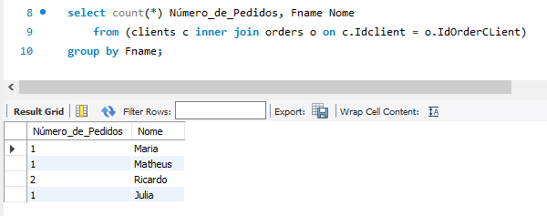
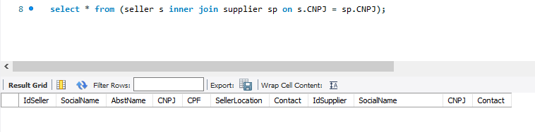
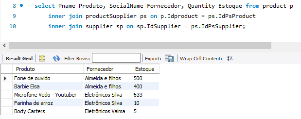

# DESAFIO DE PROJETO - ECOMMERCE

Esta doc se refere as entregas necessárias para a conclusão do desafio de projeto **Construindo seu Primeiro Projeto Lógico de Banco de Dados**!

## Querys SQL:

### Recuperações simples com SELECT Statement
select Fname from clients; | *Retorna o primeiro nome dos clientes cadastrados*
select distinct Category from product; | *Retorna as categorias dos produtos cadastrados sem redundância*

### Filtros com WHERE Statement
select concat(Fname,' ', Lname) from clients where Lname = 'Silva'; | *Retorna primeiro e último nome para os indivíduos que o último nome é 'Silva'* 
select Pname, price from product where Category = 'Eletrônico'; | *Retorna o nome e o preço para os produtos da categoria 'Eletrônico'*

### Crie expressões para gerar atributos derivados
select concat(Fname,' ', Minit,' ', Lname) NomeCompleto from clients; | *Retorna o nome completo dos clientes*
select sum(Quantity) Total from productstorage where StorageLocation = 'Rio de Janeiro'; | *Retorna a soma da quantidade de estoque para a cidade do Rio de Janeiro*

### Defina ordenações dos dados com ORDER BY
select Pname, price from product order by price desc; | *Retorna a lista de produtos ordenada baseada nos preços de forma decrescente*
select concat(Fname,' ', Minit,' ', Lname) nome_completo from clients order by Fname; | *Retorna o nome completo dos clientes ordenado por ordem alfabética*

### Condições de filtros aos grupos – HAVING Statement
select count(OrderStatus) from orders group by OrderStatus having (OrderStatus) = 'Processando'; | *Retorna o total de pedidos realizados agrupados pelo status onde o mesmo seja 'Processando'*

### Crie junções entre tabelas para fornecer uma perspectiva mais complexa dos dados
select Fname, Address from (clients c inner join orders o on c.Idclient = o.IdOrderCLient) where Address like '%Centro%'; | *Retorna o nome e o endereço de clientes que já fizeram pedidos e moram no bairro 'Centro'*

## Perguntas s serem respondidas

### Quantos pedidos foram feitos por cada cliente?
select count(*) Número_de_Pedidos, Fname Nome from (clients c inner join orders o on c.Idclient = o.IdOrderCLient) group by Fname;

Com essa query consegui recuperar a quantidade de pedidos realizados para cada cliente, porém tive que realizar mais uma inserção de pedido para que houvesse um, cliente com pelo menos dois pedidos, o restante retornou um.

### Algum vendedor também é fornecedor?
select * from (seller s inner join supplier sp on s.CNPJ = sp.CNPJ);

Ao executar a query acima nenhum dado foi retornado, o que mostra que não existe vendedores que também sejam fornecedores no nosso exemplo.

### Relação de produtos fornecedores e estoques;
select Pname Produto, SocialName Fornecedor, Quantity Estoque from product p 
	inner join productSupplier ps on p.Idproduct = ps.IdPsProduct
    inner join supplier sp on sp.IdSupplier = ps.IdPsSupplier;

Utilizando a query acima conseguimos responder a essa pergunta.

### Relação de nomes dos fornecedores e nomes dos produtos;
select SocialName Fornecedor, Pname Produto from product p 
	inner join productSupplier ps on p.Idproduct = ps.IdPsProduct
    inner join supplier sp on sp.IdSupplier = ps.IdPsSupplier;

Utilizando a query acima conseguimos responder a essa pergunta.  

<<<<<<< HEAD

=======

>>>>>>> 141c9e988f31b2b2e375527cd289fd54242549af
