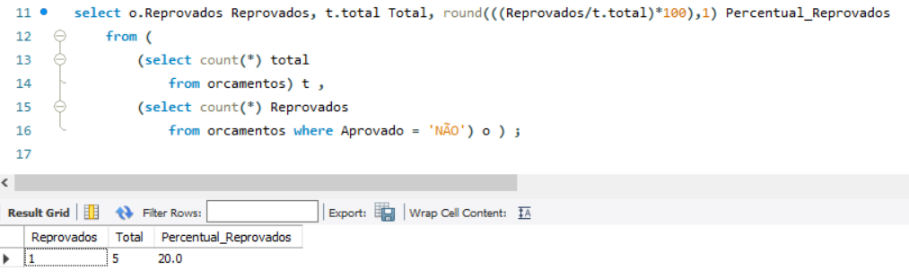
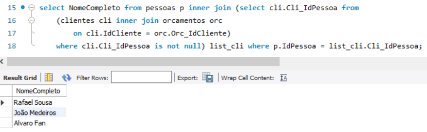
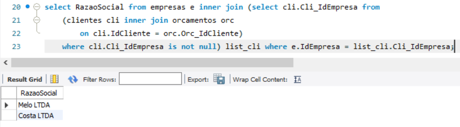

# DESAFIO DE PROJETO - ECOMMERCE

Esta doc se refere as entregas necessárias para a conclusão do desafio de projeto **Construa um Projeto Lógico de Banco de Dados do Zero**!

## Querys SQL:

### Recuperação simples com SELECT Statement
select NomeCompleto from pessoas; | *Retorna o Nome das pessoas (clientes, funcionários ou terceiros) cadastradas*

### Filtros com WHERE Statement
select NomeCompleto from pessoas where Cidade = 'Caucaia'; | *Retorna o Nome das pessoas (clientes, funcionários ou terceiros) cadastradas que moram na Cidade 'Caucaia'* 

### Crie expressões para gerar atributos derivados
select NomeCompleto, concat(Endereco,' - ', Cidade,' - ', UF) Endereco from pessoas; | *Retorna o Nome das pessoas (clientes, funcionários ou terceiros) e seus endereços completos concatenados em um único campo*
select round(sum(Valor),2) Valor from orcamentos; | *Retorna a soma de todos dos valores que foram orçados*

### Defina ordenações dos dados com ORDER BY
select NomeCompleto, Cidade from pessoas order by Cidade; | *Retorna o Nome das pessoas (clientes, funcionários ou terceiros) cadastradas ordenados alfabeticamente pela Cidade onde moram*

### Condições de filtros aos grupos – HAVING Statement
select count(Aprovado), Aprovado from orcamentos group by Aprovado having (Aprovado) <> 'AGUARDANDO'; | *Retorna o total de orçamentos que já foram finalizados*

### Crie junções entre tabelas para fornecer uma perspectiva mais complexa dos dados
select NomeCompleto, Telefone from (pessoas p inner join clientes c on p.IdPessoa = c.Cli_IdPessoa) where Cidade = 'Fortaleza'; | *Retorna o nome e os contatos das pessoas que também são clientes da oficina e que moram em 'Fortaleza'*

## Perguntas s serem respondidas

### Qual o percentual de orçamentos que foram reprovados?
select o.Reprovados Reprovados, t.total Total, round(((Reprovados/t.total)*100),1) Percentual_Reprovados 
	from (
		(select count(*) total 
			from orcamentos) t ,
		(select count(*) Reprovados 
			from orcamentos where Aprovado = 'NÃO') o ) ;

Com essa query conseguimos responder a pergunta. 

### Qual o nome dos clientes PF que aprovaram o orçamento?
select NomeCompleto from pessoas p inner join (select cli.Cli_IdPessoa from 
	(clientes cli inner join orcamentos orc 
		on cli.IdCliente = orc.Orc_IdCliente)
	where cli.Cli_IdPessoa is not null) list_cli where p.IdPessoa = list_cli.Cli_IdPessoa;

Com essa query conseguimos responder a pergunta. 

 

### Qual a Razão Social dos clientes PJ que aprovaram o orçamento?
select RazaoSocial from empresas e inner join (select cli.Cli_IdEmpresa from 
	(clientes cli inner join orcamentos orc 
		on cli.IdCliente = orc.Orc_IdCliente)
	where cli.Cli_IdEmpresa is not null) list_cli where e.IdEmpresa = list_cli.Cli_IdEmpresa;

Com essa query conseguimos responder a pergunta. 

 
